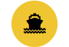
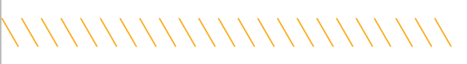
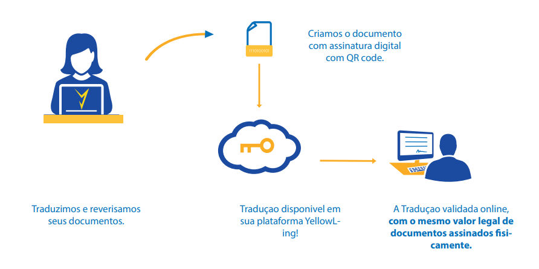
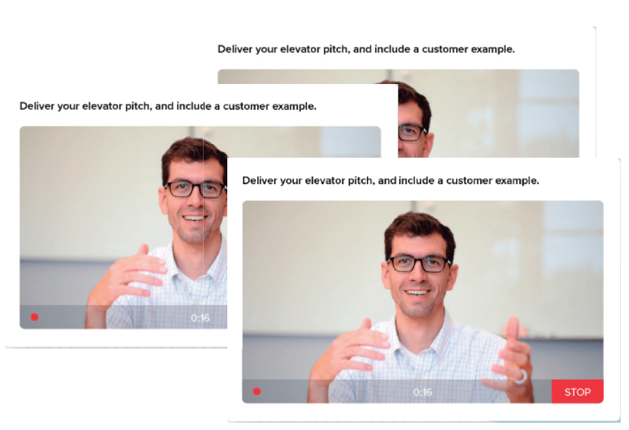

<!DOCTYPE html>
<html lang="pt">

<head>
    <meta charset="UTF-8">
    <meta name="viewport" content="width=device-width, initial-scale=1.0">
    <link rel="stylesheet" href="testes.css">
    <title>Document</title>
    <link rel="stylesheet" href="https://stackpath.bootstrapcdn.com/bootstrap/4.5.0/css/bootstrap.min.css" integrity="sha384-9aIt2nRpC12Uk9gS9baDl411NQApFmC26EwAOH8WgZl5MYYxFfc+NcPb1dKGj7Sk" crossorigin="anonymous">
    <link rel="stylesheet" type="text/css" href="myriad-pro-cufonfonts-webfont/style.css" />
</head>

<body>

    <nav class="sidebar-wrapper">
        

            

        

        

            

                

                
Idioma

                
R$ BRL

                
Help

                
Entrar

            

        

    </nav>

    <!--
    

       
    

    

        

    

    -->

    <input id="check" type="checkbox" />

    <label for="check" id="icone">
      

        
      

    </label>

    

        

            

                
Idioma

            

            

                
R$ BRL

            

            

                
Help

            

            

                
Nosso manifesto

            

            

                
Entrar

            

            

                
Orçamento

            

        

    

    

        

            

                

                    <button class="botaoMenu">
                        <b>
                            Nosso Manifesto
                        </b>
                    </button>
                    <button class="botaoMenu">
                        <b>
                            
                            Orçamento
                        </b> 
                    </button>
                

            

        

    

    <!--dentro da girafa
        
            

                <input id="checke" type="checkbox" />

                <label for="checke">
                
x

             </label>
                
                

                    <b>
                    
                    Orçamento Rápido
                </b>
                
 
            
 -->

    

        

            

                
WE ARE

                
TECHNOLOGY

                
Serviços de tradução profissional de forma fácil Produzidos por indivíduos experientes, com a potência da tecnologia, entregues com eficiência 

            

            

        

        

            

                

                

                    
WE ARE

                    
TECHNOLOGY

                    
Serviços de tradução profissional de forma fácil.   Produzidos por indivíduos experientes, com a potência da tecnologia.   Entregues com eficiência 

                

            

        

    

    

        

            

                

                    TRADUÇÕES MODO FÁCIL
                

                

                    Easy Like Sunday Morning
                

            

            

                

                    ORÇAMENTO ONLINE
                

                <label class="Umminuto" for="instantQuote">EM 1 MINUTO</label>

            

        

    

    

        

            
        

        

            

                
Traduções profíssionais

                
A maneira mais fácil, rápida e barata de traduzir com profíssionais de nível sênior. Traduçoes juramentadas, certifícadas e tecnicas.

                <a href="">

                    
Orçamento online

                </a>

            

        

        

            
        

        

            

                
Investimento em tecnologia

                
Nosso manifesto é contra inefíciência e para isto investimos em tecnologia, entregando resultados incomparaveis.

                <a href="">

                    
Nosso Manifesto

                </a>
            

        

        

            
        

        

            

                
Soluções empresariais

                
De soluções de localização a serviços de traduções de grandes volumes, oferecemos uma ampla gama de serviços de

                <a href="">

                    
Saiba mais

                </a>
            

        

    

    

        

            

                
Traduções profíssionais

                
A maneira mais fácil, rápida e barata de traduzir com profíssionais de nível sênior. Traduçoes juramentadas, certifícadas e tecnicas.

                <a href="">

                    
Orçamento online

                </a>

            

            

                
Investimento em tecnologia

                
Nosso manifesto é contra inefíciência e para isto investimos em tecnologia, entregando resultados incomparaveis.

                <a href="">

                    
Nosso Manifesto

                </a>
            

            

                
Soluções empresariais

                
De soluções de localização a serviços de traduções de grandes volumes, oferecemos uma ampla gama de serviços de

                <a href="">

                    
Saiba mais

                </a>
            

        

    

    

        

            

                

                    
WE ARE.

                    
INNOVATION

                    

                        Estamos um passo a frente.
                          Oferecemos uma ampla gama de serviços linguísticos
                          que incluem todas as suas necessidades futuras.
                          Desenvolvemos tecnologias que produzem agilidade
                    

                

            

        

        

            

                

                    

                        

                            <svg width="40px" height="40px" viewBox="0 0 16 16" class="bi bi-cone-striped" fill="currentColor" xmlns="http://www.w3.org/2000/svg">
                        <path fill-rule="evenodd" d="M7.879 11.015a.5.5 0 0 1 .242 0l6 1.5a.5.5 0 0 1 .037.96l-6 2a.499.499 0 0 1-.316 0l-6-2a.5.5 0 0 1 .037-.96l6-1.5z"/>
                        <path d="M9.97 4.88l.953 3.811C10.159 8.878 9.14 9 8 9c-1.14 0-2.159-.122-2.923-.309L6.03 4.88C6.635 4.957 7.3 5 8 5s1.365-.043 1.97-.12zm-.245-.978L8.97.88C8.718-.13 7.282-.13 7.03.88L6.275 3.9C6.8 3.965 7.382 4 8 4c.618 0 1.2-.036 1.725-.098zm2.005 8.015l-.565-2.257c-.862.212-1.964.339-3.165.339s-2.303-.127-3.165-.339l-.565 2.257 3.609-.902a.5.5 0 0 1 .242 0l3.609.902z"/>
                      </svg>
                        

                        

                            
Tradução Juramentada

                            
Realizada por um tradutor Publico juramentado

                        

                    

                    

                        

                            <svg width="40px" height="40px" viewBox="0 0 16 16" class="bi bi-cone-striped" fill="currentColor" xmlns="http://www.w3.org/2000/svg">
                        <path fill-rule="evenodd" d="M7.879 11.015a.5.5 0 0 1 .242 0l6 1.5a.5.5 0 0 1 .037.96l-6 2a.499.499 0 0 1-.316 0l-6-2a.5.5 0 0 1 .037-.96l6-1.5z"/>
                        <path d="M9.97 4.88l.953 3.811C10.159 8.878 9.14 9 8 9c-1.14 0-2.159-.122-2.923-.309L6.03 4.88C6.635 4.957 7.3 5 8 5s1.365-.043 1.97-.12zm-.245-.978L8.97.88C8.718-.13 7.282-.13 7.03.88L6.275 3.9C6.8 3.965 7.382 4 8 4c.618 0 1.2-.036 1.725-.098zm2.005 8.015l-.565-2.257c-.862.212-1.964.339-3.165.339s-2.303-.127-3.165-.339l-.565 2.257 3.609-.902a.5.5 0 0 1 .242 0l3.609.902z"/>
                      </svg>
                        

                        

                            
Tradução Jurídica

                            
Tradução com alta presisão em terminologia Jurídicsa

                        

                    

                    

                        

                            <svg width="40px" height="40px" viewBox="0 0 16 16" class="bi bi-cone-striped" fill="currentColor" xmlns="http://www.w3.org/2000/svg">
                        <path fill-rule="evenodd" d="M7.879 11.015a.5.5 0 0 1 .242 0l6 1.5a.5.5 0 0 1 .037.96l-6 2a.499.499 0 0 1-.316 0l-6-2a.5.5 0 0 1 .037-.96l6-1.5z"/>
                        <path d="M9.97 4.88l.953 3.811C10.159 8.878 9.14 9 8 9c-1.14 0-2.159-.122-2.923-.309L6.03 4.88C6.635 4.957 7.3 5 8 5s1.365-.043 1.97-.12zm-.245-.978L8.97.88C8.718-.13 7.282-.13 7.03.88L6.275 3.9C6.8 3.965 7.382 4 8 4c.618 0 1.2-.036 1.725-.098zm2.005 8.015l-.565-2.257c-.862.212-1.964.339-3.165.339s-2.303-.127-3.165-.339l-.565 2.257 3.609-.902a.5.5 0 0 1 .242 0l3.609.902z"/>
                      </svg>
                        

                        

                            
Tradução Comercial

                            
Contratos internacinais, documentos técnicos. 

                        

                    

                

                

                    

                        

                            <svg width="40px" height="40px" viewBox="0 0 16 16" class="bi bi-cone-striped" fill="currentColor" xmlns="http://www.w3.org/2000/svg">
                        <path fill-rule="evenodd" d="M7.879 11.015a.5.5 0 0 1 .242 0l6 1.5a.5.5 0 0 1 .037.96l-6 2a.499.499 0 0 1-.316 0l-6-2a.5.5 0 0 1 .037-.96l6-1.5z"/>
                        <path d="M9.97 4.88l.953 3.811C10.159 8.878 9.14 9 8 9c-1.14 0-2.159-.122-2.923-.309L6.03 4.88C6.635 4.957 7.3 5 8 5s1.365-.043 1.97-.12zm-.245-.978L8.97.88C8.718-.13 7.282-.13 7.03.88L6.275 3.9C6.8 3.965 7.382 4 8 4c.618 0 1.2-.036 1.725-.098zm2.005 8.015l-.565-2.257c-.862.212-1.964.339-3.165.339s-2.303-.127-3.165-.339l-.565 2.257 3.609-.902a.5.5 0 0 1 .242 0l3.609.902z"/>
                      </svg>
                        

                        

                            
Tradução Audaneira

                            
Comercio exterior e documentos técnicos.

                        

                    

                    

                        

                            <svg width="40px" height="40px" viewBox="0 0 16 16" class="bi bi-globe" fill="currentColor" xmlns="http://www.w3.org/2000/svg">
                        <path fill-rule="evenodd" d="M1.018 7.5h2.49c.03-.877.138-1.718.312-2.5H1.674a6.958 6.958 0 0 0-.656 2.5zM2.255 4H4.09a9.266 9.266 0 0 1 .64-1.539 6.7 6.7 0 0 1 .597-.933A7.024 7.024 0 0 0 2.255 4zM8 0a8 8 0 1 0 0 16A8 8 0 0 0 8 0zm-.5 1.077c-.67.204-1.335.82-1.887 1.855-.173.324-.33.682-.468 1.068H7.5V1.077zM7.5 5H4.847a12.5 12.5 0 0 0-.338 2.5H7.5V5zm1 2.5V5h2.653c.187.765.306 1.608.338 2.5H8.5zm-1 1H4.51a12.5 12.5 0 0 0 .337 2.5H7.5V8.5zm1 2.5V8.5h2.99a12.495 12.495 0 0 1-.337 2.5H8.5zm-1 1H5.145c.138.386.295.744.468 1.068.552 1.035 1.218 1.65 1.887 1.855V12zm-2.173 2.472a6.695 6.695 0 0 1-.597-.933A9.267 9.267 0 0 1 4.09 12H2.255a7.024 7.024 0 0 0 3.072 2.472zM1.674 11H3.82a13.651 13.651 0 0 1-.312-2.5h-2.49c.062.89.291 1.733.656 2.5zm8.999 3.472A7.024 7.024 0 0 0 13.745 12h-1.834a9.278 9.278 0 0 1-.641 1.539 6.688 6.688 0 0 1-.597.933zM10.855 12H8.5v2.923c.67-.204 1.335-.82 1.887-1.855A7.98 7.98 0 0 0 10.855 12zm1.325-1h2.146c.365-.767.594-1.61.656-2.5h-2.49a13.65 13.65 0 0 1-.312 2.5zm.312-3.5h2.49a6.959 6.959 0 0 0-.656-2.5H12.18c.174.782.282 1.623.312 2.5zM11.91 4a9.277 9.277 0 0 0-.64-1.539 6.692 6.692 0 0 0-.597-.933A7.024 7.024 0 0 1 13.745 4h-1.834zm-1.055 0H8.5V1.077c.67.204 1.335.82 1.887 1.855.173.324.33.682.468 1.068z"/>
                      </svg>
                        

                        

                            
Tradução Website

                            
localização e traduzir, suporte SEO multilingual

                        

                    

                    

                        

                            <svg width="40px" height="40px" viewBox="0 0 16 16" class="bi bi-app-indicator" fill="currentColor" xmlns="http://www.w3.org/2000/svg">
                        <path fill-rule="evenodd" d="M5.5 2A3.5 3.5 0 0 0 2 5.5v5A3.5 3.5 0 0 0 5.5 14h5a3.5 3.5 0 0 0 3.5-3.5V8a.5.5 0 0 1 1 0v2.5a4.5 4.5 0 0 1-4.5 4.5h-5A4.5 4.5 0 0 1 1 10.5v-5A4.5 4.5 0 0 1 5.5 1H8a.5.5 0 0 1 0 1H5.5z"/>
                        <path d="M16 3a3 3 0 1 1-6 0 3 3 0 0 1 6 0z"/>
                      </svg>
                        

                        

                            
Tradução Apps

                            
localização e traduzir de softwares Android.

                        

                    

                

            

        

    

    

        
    

    

        

            
eSIGNATURE.

            
Traduçoes juramentadas e certfivadas com br assinatura digital.   Mesma validade legal da assinatura Fisica.   Economia com logistica, segurança e agilidade.

            
        

        

            
        

    

    

        
TRUSTED BY.

        
Professional translation services made easy. 

        

            

            

            

            

            

            

            

            

        

    

    

        

        

            
NOSSA CULTURA.

            
Nós nos orgulhamos de remunerar nossos tradutores de forma justa e fornecer um ambiente de trabalho colaborativo, divertido e aberto a todos: uma cultura que inspira indivíduos talentosos a fazer grandes coisas por você.

        

    

    

        

            

                
RESPONSABILIDADE SOCIAL

                
Poupamos centenas de quilos de CO2 por ano, investimos em tecnologia para  reduzir em 80 % o uso de papeis.   Fazemos historia,
                    <b>convertemo um percentual de nossas vendas  
                para ajudar projetos sociais no Brasil e no mundo...</b> 

            

        

        

            

                Saiba mais...
            

        

    

    

        

            
Ainda tem dúvidas?   Entre em contato.

            
Nossa equeipe está pronta para  encontrar ma solução para as suas   necessidades de tradução

            
 Fale conosco

        

        

            

                
            

            
What is Lorem Ipsum?

            
Lorem Ipsum is simply dummy text of the printing and typesetting industry.

        

    

    <svg viewBox="0 0 1440 320">
        <path fill="#e0dede" fill-opacity="1" d="M0,96L60,96C120,96,240,96,360,106.7C480,117,600,139,720,160C840,181,960,203,1080,208C1200,213,1320,203,1380,197.3L1440,192L1440,320L1380,320C1320,320,1200,320,1080,320C960,320,840,320,720,320C600,320,480,320,360,320C240,320,120,320,60,320L0,320Z"></path>
      </svg>

    <footer>

        <!-- girafa orçamento-->

    </footer>
    <!--Ajax menu-->

    
    
    
    

</body>

</html>
